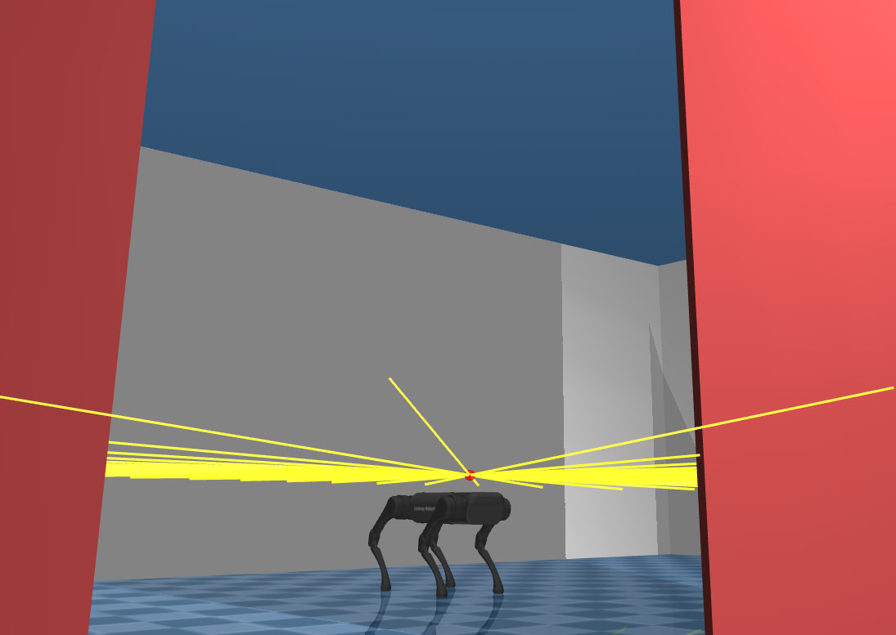
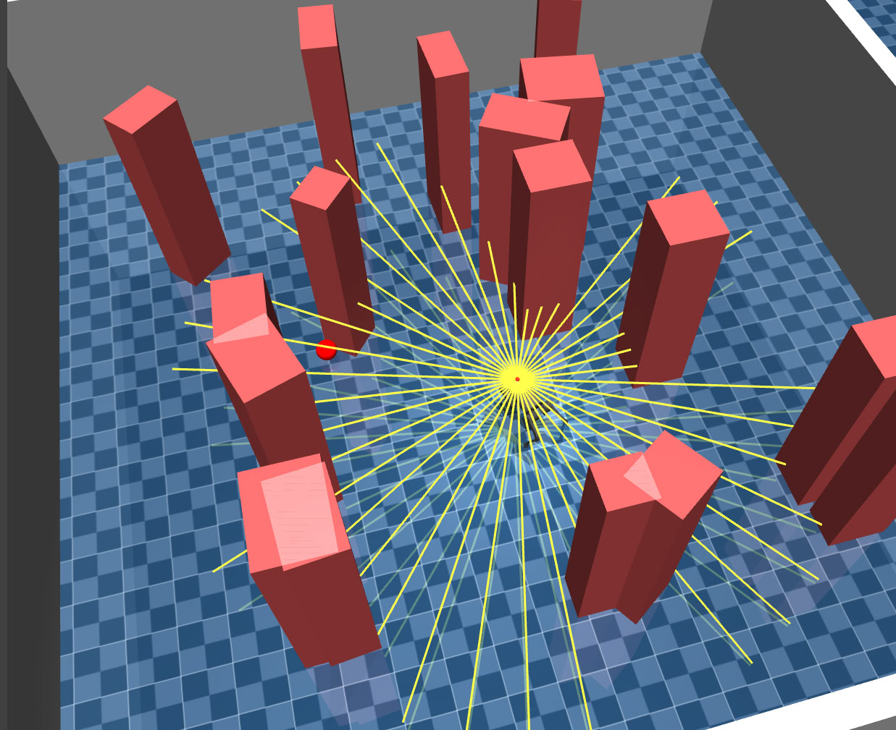

# SuperDog

**SuperDog** is a path-planning repository for the **Unitree A1** quadruped robot. A high-level **Soft Actor-Critic (SAC)** policy generates velocity commands, and a frozen pretrained walking policy converts them into 12-DOF joint torques. The robot navigates from a random spawn point to a goal in a room with randomly placed obstacles.

> **Where to start**
>
> - Run & install instructions: [RUNME.md](RUNME.md)
> - Robot config and SAC hyperparameters: [configs/a1.yaml](configs/a1.yaml)
> - Curriculum learning schedule: [configs/curriculum.yaml](configs/curriculum.yaml)

<p align="center">
  
  
</p>

<a id="table-of-contents"></a>

## Table of Contents

1. [Overview](#overview)
2. [Environment](#environment)
3. [Architecture](#architecture)
4. [Observation Space](#observation-space)
5. [Action Space](#action-space)
6. [Reward Function](#reward-function)
7. [Curriculum Learning](#curriculum-learning)
8. [Hyperparameters](#hyperparameters)

---

<a id="overview"></a>

## Overview

SuperDog trains a navigation policy through **curriculum learning** across 7 difficulty levels, progressively increasing obstacle count and tightening reward shaping.

### Policy stack

| Layer | Role | Frequency |
|---|---|---|
| SAC Actor | Generates `[vx, vy, ω]` velocity command | 10 Hz (configurable) |
| Walking Policy | Converts command to 12 joint torques | 50 Hz |
| MuJoCo Simulator | Physics step | 500 Hz |

### Core definitions used throughout the README

| Term | Definition |
|---|---|
| **Episode** | One complete rollout from spawn to goal-reached, collision, or timeout. |
| **Success rate** | Fraction of episodes where the robot reaches the goal. Averaged over the last 100 episodes. |
| **Curriculum level** | A difficulty stage that sets obstacle count, episode length, reward weights, and SAC hyperparameters. Advances when `success_rate` exceeds the level threshold. |
| **Asymmetric actor-critic** | The actor sees only sensor data available on a real robot (with noise). The critic sees clean privileged data with additional features (velocity, nearest obstacles). |

---

<a id="environment"></a>

## Environment

<p align="center">
  
  
</p>

| Property | Value |
|---|---|
| Robot | Unitree A1 (12 DOF) |
| Simulator | MuJoCo 3.2.3 |
| Room size | Fixed rectangular room |
| Obstacles | 3–20 random boxes (depends on curriculum level) |
| Episode length | 6 000–17 000 steps (curriculum-dependent) |
| Spawn | Random free-space point with clearance ≥ 0.7 m |
| Goal | Random free-space point |

---

<a id="architecture"></a>

## Architecture

The architecture uses **asymmetric actor-critic**: the critic receives additional privileged information (velocity, obstacle proximity) that the actor does not see — enabling better value estimation while the actor remains deployable on a real robot with limited sensors.

<!-- Inline network diagram -->
<div style="display:flex; gap:16px; align-items:flex-start; margin:16px 0;">

  <!-- ACTOR -->
  <div style="flex:1; border:2px solid #1565c0; border-radius:10px; padding:16px 12px; background:#fff;">
    <div style="text-align:center; margin-bottom:12px; padding-bottom:10px; border-bottom:2px solid #eee;">
      <div style="font-size:17px; font-weight:700; color:#1565c0;">Actor</div>
      <div style="font-size:11px; color:#999; font-family:monospace;">DiagGaussianActor</div>
    </div>
    <div style="background:#e3f2fd; border:1px solid #90caf9; color:#0d47a1; border-radius:6px; padding:8px; text-align:center; font-size:13px; margin-bottom:3px;"><b>Input</b> <code>56</code><br>base_obs(47) + action_history(3x3)</div>
    <div style="text-align:center; color:#bbb;">↓</div>
    <div style="background:#1565c0; color:#fff; border-radius:6px; padding:7px; text-align:center; font-size:13px; margin-bottom:3px;">Linear(56 → 512) + ReLU</div>
    <div style="text-align:center; color:#bbb;">↓</div>
    <div style="background:#1565c0; color:#fff; border-radius:6px; padding:7px; text-align:center; font-size:13px; margin-bottom:3px;">Linear(512 → 512) + ReLU</div>
    <div style="text-align:center; color:#bbb;">↓</div>
    <div style="background:#1565c0; color:#fff; border-radius:6px; padding:7px; text-align:center; font-size:13px; margin-bottom:3px;">Linear(512 → 256) + ReLU</div>
    <div style="text-align:center; color:#bbb;">↓</div>
    <div style="background:#1565c0; color:#fff; border-radius:6px; padding:7px; text-align:center; font-size:13px; margin-bottom:3px;">Linear(256 → 6)</div>
    <div style="text-align:center; color:#bbb;">↓</div>
    <div style="background:#fff8e1; border:1px solid #ffca28; color:#6d4c00; border-radius:6px; padding:8px; text-align:center; font-size:12px; margin-bottom:3px;"><b>Split → μ(3), log_σ(3)</b><br>log_σ = tanh → clamp [−2, 2]</div>
    <div style="text-align:center; color:#bbb;">↓</div>
    <div style="background:#2e7d32; color:#fff; border-radius:6px; padding:8px; text-align:center; font-size:13px; font-weight:700;">Output: SquashedNormal → tanh<br>[vx, vy, ω] ∈ [−1, 1]³</div>
  </div>

  <!-- CRITIC Q1 -->
  <div style="flex:1; border:2px solid #c62828; border-radius:10px; padding:16px 12px; background:#fff;">
    <div style="text-align:center; margin-bottom:12px; padding-bottom:10px; border-bottom:2px solid #eee;">
      <div style="font-size:17px; font-weight:700; color:#c62828;">Critic Q₁</div>
      <div style="font-size:11px; color:#999; font-family:monospace;">DoubleQCritic — network 1</div>
    </div>
    <div style="background:#ffebee; border:1px solid #ef9a9a; color:#b71c1c; border-radius:6px; padding:8px; text-align:center; font-size:13px; margin-bottom:3px;"><b>Observation</b> <code>201</code><br>critic_base(49) × 4 frames + top_k(5)</div>
    <div style="height:4px;"></div>
    <div style="background:#e8f5e9; border:1px solid #a5d6a7; color:#1b5e20; border-radius:6px; padding:7px; text-align:center; font-size:13px; margin-bottom:3px;"><b>Action</b> <code>3</code> — from Actor</div>
    <div style="text-align:center; color:#bbb; font-size:12px;">concat ↓</div>
    <div style="background:#fffde7; border:1px solid #fff176; color:#f57f17; border-radius:6px; padding:7px; text-align:center; font-size:13px; margin-bottom:3px;"><b>Concatenated</b> <code>204</code></div>
    <div style="text-align:center; color:#bbb;">↓</div>
    <div style="background:#c62828; color:#fff; border-radius:6px; padding:7px; text-align:center; font-size:13px; margin-bottom:3px;">Linear(204 → 512) + ReLU</div>
    <div style="text-align:center; color:#bbb;">↓</div>
    <div style="background:#c62828; color:#fff; border-radius:6px; padding:7px; text-align:center; font-size:13px; margin-bottom:3px;">Linear(512 → 512) + ReLU</div>
    <div style="text-align:center; color:#bbb;">↓</div>
    <div style="background:#c62828; color:#fff; border-radius:6px; padding:7px; text-align:center; font-size:13px; margin-bottom:3px;">Linear(512 → 256) + ReLU</div>
    <div style="text-align:center; color:#bbb;">↓</div>
    <div style="background:#c62828; color:#fff; border-radius:6px; padding:7px; text-align:center; font-size:13px; margin-bottom:3px;">Linear(256 → 1)</div>
    <div style="text-align:center; color:#bbb;">↓</div>
    <div style="background:#2e7d32; color:#fff; border-radius:6px; padding:8px; text-align:center; font-size:13px; font-weight:700;">Output: Q₁(s, a) → scalar</div>
  </div>

  <!-- CRITIC Q2 -->
  <div style="flex:1; border:2px solid #e65100; border-radius:10px; padding:16px 12px; background:#fff;">
    <div style="text-align:center; margin-bottom:12px; padding-bottom:10px; border-bottom:2px solid #eee;">
      <div style="font-size:17px; font-weight:700; color:#e65100;">Critic Q₂</div>
      <div style="font-size:11px; color:#999; font-family:monospace;">DoubleQCritic — network 2</div>
    </div>
    <div style="background:#fff3e0; border:1px solid #ffcc80; color:#bf360c; border-radius:6px; padding:8px; text-align:center; font-size:13px; margin-bottom:3px;"><b>Observation</b> <code>201</code><br>critic_base(49) × 4 frames + top_k(5)</div>
    <div style="height:4px;"></div>
    <div style="background:#e8f5e9; border:1px solid #a5d6a7; color:#1b5e20; border-radius:6px; padding:7px; text-align:center; font-size:13px; margin-bottom:3px;"><b>Action</b> <code>3</code> — from Actor</div>
    <div style="text-align:center; color:#bbb; font-size:12px;">concat ↓</div>
    <div style="background:#fffde7; border:1px solid #fff176; color:#f57f17; border-radius:6px; padding:7px; text-align:center; font-size:13px; margin-bottom:3px;"><b>Concatenated</b> <code>204</code></div>
    <div style="text-align:center; color:#bbb;">↓</div>
    <div style="background:#e65100; color:#fff; border-radius:6px; padding:7px; text-align:center; font-size:13px; margin-bottom:3px;">Linear(204 → 512) + ReLU</div>
    <div style="text-align:center; color:#bbb;">↓</div>
    <div style="background:#e65100; color:#fff; border-radius:6px; padding:7px; text-align:center; font-size:13px; margin-bottom:3px;">Linear(512 → 512) + ReLU</div>
    <div style="text-align:center; color:#bbb;">↓</div>
    <div style="background:#e65100; color:#fff; border-radius:6px; padding:7px; text-align:center; font-size:13px; margin-bottom:3px;">Linear(512 → 256) + ReLU</div>
    <div style="text-align:center; color:#bbb;">↓</div>
    <div style="background:#e65100; color:#fff; border-radius:6px; padding:7px; text-align:center; font-size:13px; margin-bottom:3px;">Linear(256 → 1)</div>
    <div style="text-align:center; color:#bbb;">↓</div>
    <div style="background:#2e7d32; color:#fff; border-radius:6px; padding:8px; text-align:center; font-size:13px; font-weight:700;">Output: Q₂(s, a) → scalar</div>
  </div>

</div>

<div style="text-align:center; margin:12px 0; padding:8px; background:#f5f5f5; border:1px dashed #ccc; border-radius:8px; font-size:13px; color:#444;">
  Actor update uses <b>min(Q₁, Q₂)</b> — clipped double-Q to reduce value overestimation
</div>

<div style="display:flex; gap:0; margin:16px 0; border:1px solid #ddd; border-radius:8px; overflow:hidden; font-size:12px; text-align:center;">
  <div style="flex:1; padding:8px; background:#e3f2fd; color:#0d47a1;"><b>α (temperature)</b><br>learnable, init = 0.2</div>
  <div style="flex:1; padding:8px; background:#ffebee; color:#b71c1c; border-left:1px solid #ddd;"><b>Target critic</b><br>soft update τ = 0.005</div>
  <div style="flex:1; padding:8px; background:#e8f5e9; color:#1b5e20; border-left:1px solid #ddd;"><b>Weight init</b><br>Orthogonal</div>
  <div style="flex:1; padding:8px; background:#fff8e1; color:#e65100; border-left:1px solid #ddd;"><b>Target entropy</b><br>−3</div>
  <div style="flex:1; padding:8px; background:#f3e5f5; color:#6a1b9a; border-left:1px solid #ddd;"><b>Discount γ</b><br>0.99</div>
</div>

---

<a id="observation-space"></a>

## Observation Space

The project uses **asymmetric observations**: the actor sees only sensor data available on a real robot (with noise), while the critic sees clean privileged data with additional features.

<details>
<summary><b>Actor observation breakdown (47 → 56 dims)</b></summary>

<table style="width:100%; border-collapse:collapse; font-size:13px; border:1px solid #ddd; margin-top:8px;">
  <tr style="background:#f5f5f5;"><th style="padding:8px; text-align:left; border-bottom:2px solid #ccc; color:#555;">#</th><th style="padding:8px; text-align:left; border-bottom:2px solid #ccc; color:#555;">Component</th><th style="padding:8px; text-align:center; border-bottom:2px solid #ccc; color:#555;">Dim</th><th style="padding:8px; text-align:left; border-bottom:2px solid #ccc; color:#555;">Normalization / Notes</th></tr>
  <tr><td style="padding:7px 10px;">1</td><td style="padding:7px 10px;">LiDAR sectors (40 beams, min-pooled)</td><td style="padding:7px 10px; text-align:center; font-weight:700; color:#1565c0; font-family:monospace; font-size:14px;">40</td><td style="padding:7px 10px; color:#888; font-size:12px;">[0, 3m] → [−1, 1], noise σ = 0.02 m</td></tr>
  <tr><td style="padding:7px 10px;">2</td><td style="padding:7px 10px;">Angular velocity ω</td><td style="padding:7px 10px; text-align:center; font-weight:700; color:#1565c0; font-family:monospace; font-size:14px;">1</td><td style="padding:7px 10px; color:#888; font-size:12px;">÷ max_angular_vel, noise σ = 0.02 rad/s</td></tr>
  <tr><td style="padding:7px 10px;">3</td><td style="padding:7px 10px;">sin(angle to target)</td><td style="padding:7px 10px; text-align:center; font-weight:700; color:#1565c0; font-family:monospace; font-size:14px;">1</td><td style="padding:7px 10px; color:#888; font-size:12px;">clipped [−1, 1], noise σ = 0.05 rad</td></tr>
  <tr><td style="padding:7px 10px;">4</td><td style="padding:7px 10px;">cos(angle to target)</td><td style="padding:7px 10px; text-align:center; font-weight:700; color:#1565c0; font-family:monospace; font-size:14px;">1</td><td style="padding:7px 10px; color:#888; font-size:12px;">clipped [−1, 1], noise σ = 0.05 rad</td></tr>
  <tr><td style="padding:7px 10px;">5</td><td style="padding:7px 10px;">Distance to target</td><td style="padding:7px 10px; text-align:center; font-weight:700; color:#1565c0; font-family:monospace; font-size:14px;">1</td><td style="padding:7px 10px; color:#888; font-size:12px;">[0, max_dist] → [−1, 1], noise σ = 0.05 m</td></tr>
  <tr><td style="padding:7px 10px;">6</td><td style="padding:7px 10px;">Previous action [vx, vy, ω]</td><td style="padding:7px 10px; text-align:center; font-weight:700; color:#1565c0; font-family:monospace; font-size:14px;">3</td><td style="padding:7px 10px; color:#888; font-size:12px;">clipped [−1, 1]</td></tr>
  <tr style="background:#f5f5f5; font-weight:700; border-top:1px solid #ddd;"><td style="padding:7px 10px;"></td><td style="padding:7px 10px;">Base observation</td><td style="padding:7px 10px; text-align:center; color:#1565c0; font-family:monospace; font-size:14px;">47</td><td style="padding:7px 10px;"></td></tr>
  <tr><td style="padding:7px 10px;">7</td><td style="padding:7px 10px;">Action history (last 3 steps × 3 dims)</td><td style="padding:7px 10px; text-align:center; font-weight:700; color:#1565c0; font-family:monospace; font-size:14px;">9</td><td style="padding:7px 10px; color:#888; font-size:12px;">appended to base</td></tr>
  <tr style="background:#f5f5f5; font-weight:700; border-top:1px solid #ddd;"><td style="padding:7px 10px;"></td><td style="padding:7px 10px;">Actor network input</td><td style="padding:7px 10px; text-align:center; color:#1565c0; font-family:monospace; font-size:14px;">56</td><td style="padding:7px 10px;"></td></tr>
</table>

</details>

<details>
<summary><b>Critic observation breakdown (49 → 201 dims)</b></summary>

<table style="width:100%; border-collapse:collapse; font-size:13px; border:1px solid #ddd; margin-top:8px;">
  <tr style="background:#f5f5f5;"><th style="padding:8px; text-align:left; border-bottom:2px solid #ccc; color:#555;">#</th><th style="padding:8px; text-align:left; border-bottom:2px solid #ccc; color:#555;">Component</th><th style="padding:8px; text-align:center; border-bottom:2px solid #ccc; color:#555;">Dim</th><th style="padding:8px; text-align:left; border-bottom:2px solid #ccc; color:#555;">Notes</th></tr>
  <tr><td style="padding:7px 10px;">1</td><td style="padding:7px 10px;">Actor base observation (clean, no noise)</td><td style="padding:7px 10px; text-align:center; font-weight:700; color:#c62828; font-family:monospace; font-size:14px;">47</td><td style="padding:7px 10px; color:#888; font-size:12px;">Same features, zero noise</td></tr>
  <tr style="background:#fff8f8;"><td style="padding:7px 10px;">2</td><td style="padding:7px 10px;">Forward velocity vx</td><td style="padding:7px 10px; text-align:center; font-weight:700; color:#c62828; font-family:monospace; font-size:14px;">1</td><td style="padding:7px 10px; color:#888; font-size:12px;">Privileged — not available to actor</td></tr>
  <tr style="background:#fff8f8;"><td style="padding:7px 10px;">3</td><td style="padding:7px 10px;">Lateral velocity vy</td><td style="padding:7px 10px; text-align:center; font-weight:700; color:#c62828; font-family:monospace; font-size:14px;">1</td><td style="padding:7px 10px; color:#888; font-size:12px;">Privileged — not available to actor</td></tr>
  <tr style="background:#f5f5f5; font-weight:700; border-top:1px solid #ddd;"><td style="padding:7px 10px;"></td><td style="padding:7px 10px;">Critic base (single frame)</td><td style="padding:7px 10px; text-align:center; color:#c62828; font-family:monospace; font-size:14px;">49</td><td style="padding:7px 10px;"></td></tr>
  <tr><td style="padding:7px 10px;">4</td><td style="padding:7px 10px;">History stacking: 4 frames (t, t−1, t−2, t−3)</td><td style="padding:7px 10px; text-align:center; font-weight:700; color:#c62828; font-family:monospace; font-size:14px;">196</td><td style="padding:7px 10px; color:#888; font-size:12px;">49 × 4 = 196</td></tr>
  <tr style="background:#fff8f8;"><td style="padding:7px 10px;">5</td><td style="padding:7px 10px;">Top-5 nearest LiDAR distances</td><td style="padding:7px 10px; text-align:center; font-weight:700; color:#c62828; font-family:monospace; font-size:14px;">5</td><td style="padding:7px 10px; color:#888; font-size:12px;">Privileged: sorted raw beams, normalized</td></tr>
  <tr style="background:#f5f5f5; font-weight:700; border-top:1px solid #ddd;"><td style="padding:7px 10px;"></td><td style="padding:7px 10px;">Critic observation input</td><td style="padding:7px 10px; text-align:center; color:#c62828; font-family:monospace; font-size:14px;">201</td><td style="padding:7px 10px;"></td></tr>
  <tr><td style="padding:7px 10px;">6</td><td style="padding:7px 10px;">Action [vx, vy, ω] (concat by Q-network)</td><td style="padding:7px 10px; text-align:center; font-weight:700; color:#c62828; font-family:monospace; font-size:14px;">3</td><td style="padding:7px 10px; color:#888; font-size:12px;">From actor output</td></tr>
  <tr style="background:#f5f5f5; font-weight:700; border-top:1px solid #ddd;"><td style="padding:7px 10px;"></td><td style="padding:7px 10px;">Q-network first Linear input</td><td style="padding:7px 10px; text-align:center; color:#c62828; font-family:monospace; font-size:14px;">204</td><td style="padding:7px 10px;"></td></tr>
</table>

</details>

---

<a id="action-space"></a>

## Action Space

The SAC actor outputs a 3-dimensional continuous command, squashed through `tanh` into `[-1, 1]`:

| Dim | Variable | Scale |
|---|---|---|
| 0 | `vx` — forward velocity | `cmd_scale[0] = 1.0` |
| 1 | `vy` — lateral velocity | `cmd_scale[1] = 0.5` |
| 2 | `ω` — yaw rate | `cmd_scale[2] = 0.35` |

---

<a id="reward-function"></a>

## Reward Function

| Term | Weight | Description |
|---|---|---|
| `reached` | +100.0 | Terminal: goal reached (dist < 0.2 m) |
| `collision` | −500.0 | Terminal: collision (dist to obstacle < 0.35 m) |
| `progress` | +20.0 | Distance reduction toward goal per step |
| `obs_penalty` | −5.0 × f(d) | Exponential penalty for proximity to obstacles |
| `time_penalty` | −0.02 | Per-step penalty to discourage slow trajectories |
| `vx_backward` | −1.0 | Penalty for negative forward velocity |
| `vy_penalty` | −1.0 | Penalty for excessive lateral velocity |
| `velocity_alignment` | +0.5 | Reward for moving in the facing direction |

The obstacle proximity penalty uses an exponential envelope:

```
obs_penalty = obs_penalty_weight × exp(obstacle_exponential_scale × (1 − d / obstacle_threshold))
```

where `d` is the distance to the nearest obstacle and the penalty activates when `d < obstacle_threshold = 1.5 m`.

Reward weights are overridden per curriculum level (see [configs/curriculum.yaml](configs/curriculum.yaml)).

---

<a id="curriculum-learning"></a>

## Curriculum Learning

Training progresses through 7 levels. A level advances when `success_rate` (averaged over the last 100 episodes) exceeds the level threshold. Each level independently adjusts obstacle count, episode length, reward weights, and SAC hyperparameters.

| Level | Name | Obstacles | Max Steps | Success Target |
|---|---|---|---|---|
| 1 | Initial Learning | 3–5 | 6 000 | 20% |
| 2 | Obstacle Awareness | 4–7 | 7 500 | 40% |
| 3 | Collision Reduction | 6–9 | 9 000 | 60% |
| 4 | Efficiency Optimization | 8–12 | 11 000 | 88% |
| 5 | Mastery | 10–14 | 13 000 | 95% |
| 6 | Perfection | 12–17 | 15 000 | 95% |
| 7 | Polish & Perfection | 15–20 | 17 000 | 97% |

<details>
<summary><b>Click to expand per-level reward and SAC overrides</b></summary>

| Parameter | L1 | L2 | L3 | L4 | L5 | L6 | L7 |
|---|---|---|---|---|---|---|---|
| **Reward weights** | | | | | | | |
| collision | −300 | −400 | −500 | −600 | −800 | −1 000 | −1 500 |
| obs_penalty_weight | 3.0 | 4.0 | 5.0 | 5.5 | 6.0 | 7.0 | 8.0 |
| obstacle_threshold | 1.6 | 1.5 | 1.5 | 1.4 | 1.3 | 1.2 | 1.15 |
| progress | 25 | 22 | 20 | 25 | 30 | 35 | 40 |
| time_penalty | −0.01 | −0.015 | −0.02 | −0.1 | −0.1 | −0.15 | −0.16 |
| vx_backward_penalty | — | — | −2.5 | −3.0 | −3.0 | −5.0 | −6.0 |
| velocity_alignment | — | — | 0.7 | — | — | — | 2.0 |
| **SAC overrides** | | | | | | | |
| actor_lr | 2e-4 | 1.5e-4 | 1e-4 | 8e-5 | 5e-5 | 3e-5 | 1e-5 |
| critic_lr | 5e-4 | 4e-4 | 3e-4 | 2.5e-4 | 2e-4 | 1.5e-4 | 1e-4 |
| init_temperature | 0.1 | 0.15 | 0.2 | 0.3 | 0.4 | 0.6 | 0.8 |
| batch_size | 128 | 192 | 256 | 320 | 384 | 448 | 512 |
| training_iterations | 2 | 3 | 4 | 5 | 6 | 8 | 10 |
| **Replay buffer** | | | | | | | |
| success_weight | 1.5 | 2.0 | 1.5 | 1.5 | 1.0 | 1.5 | 2.0 |
| collision_weight | 1.5 | 1.5 | 2.0 | 3.0 | 5.0 | 10.0 | 15.0 |

Full configuration: [configs/curriculum.yaml](configs/curriculum.yaml).

</details>

---

<a id="hyperparameters"></a>

## Initial Hyperparameters

<details>
<summary><b>Click to expand SAC hyperparameters table</b></summary>

| Hyperparameter | Value |
|---|---|
| **Network** | |
| Actor hidden dims | [512, 512, 256] |
| Critic hidden dims | [512, 512, 256] |
| Weight init | Orthogonal |
| Actor log_std bounds | [−2, 2] |
| **Optimization** | |
| Actor learning rate | 1e-4 |
| Critic learning rate | 3e-4 |
| Alpha learning rate | 3e-4 |
| All betas | (0.9, 0.999) |
| Discount γ | 0.99 |
| Critic soft update τ | 0.005 |
| Actor update frequency | every step |
| Critic target update frequency | every 2 steps |
| **Entropy** | |
| Initial temperature α | 0.2 |
| Target entropy | −1.5 |
| Learnable temperature | yes |
| **Replay buffer** | |
| Buffer size | 1 000 000 |
| Batch size | 512 |
| Training iterations per step | 4 |
| Min buffer size before training | 5 000 |
| **History** | |
| Actor history (action) | 3 steps |
| Critic history (observation) | 3 frames |
| Critic top-k nearest | 5 |

These are the base hyperparameters from [configs/a1.yaml](configs/a1.yaml). Each curriculum level overrides a subset of them — see [configs/curriculum.yaml](configs/curriculum.yaml) for per-level values.

</details>
