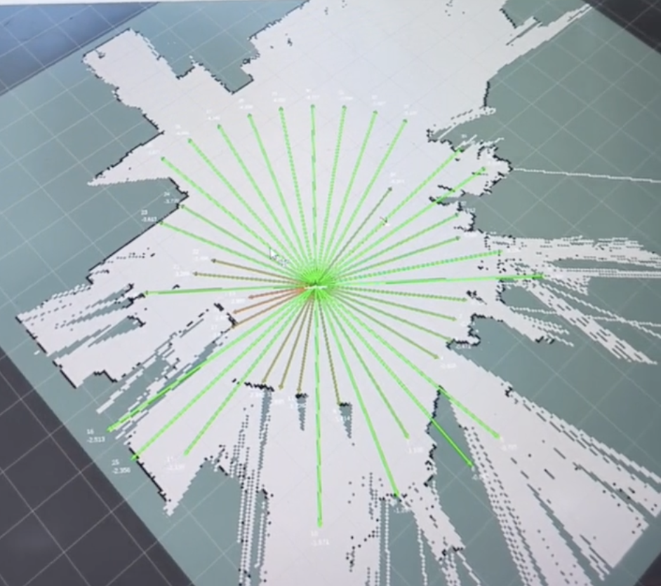
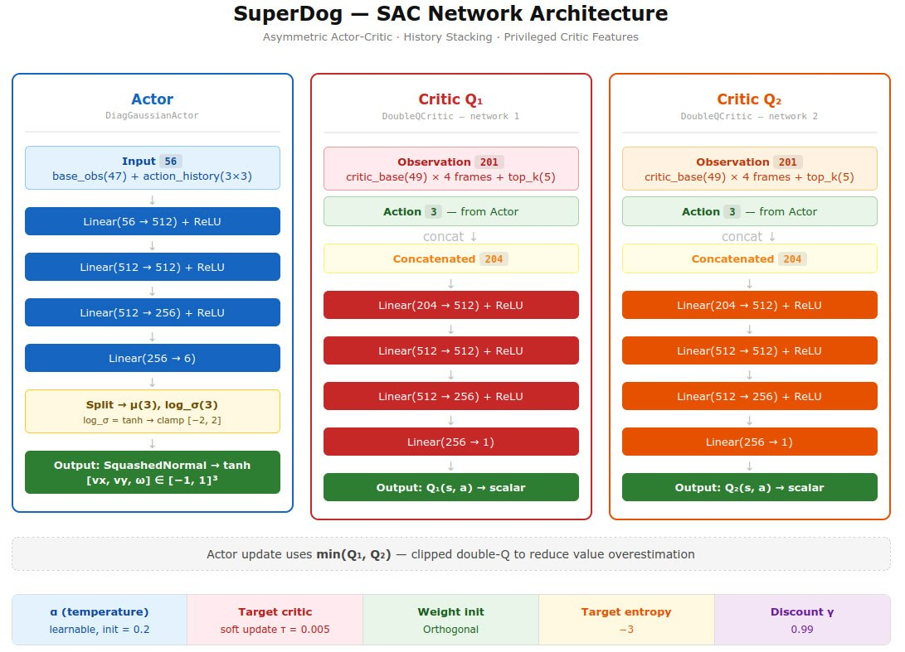
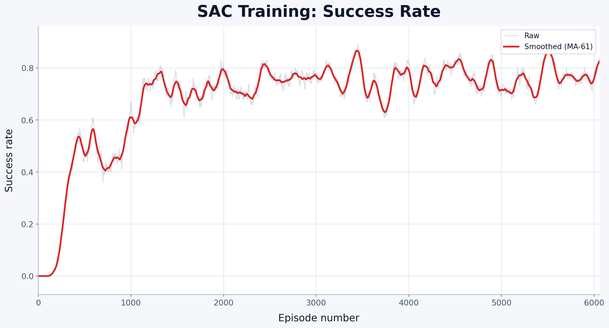
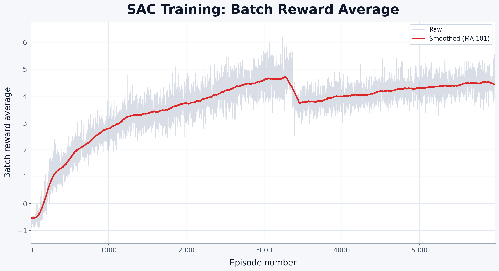
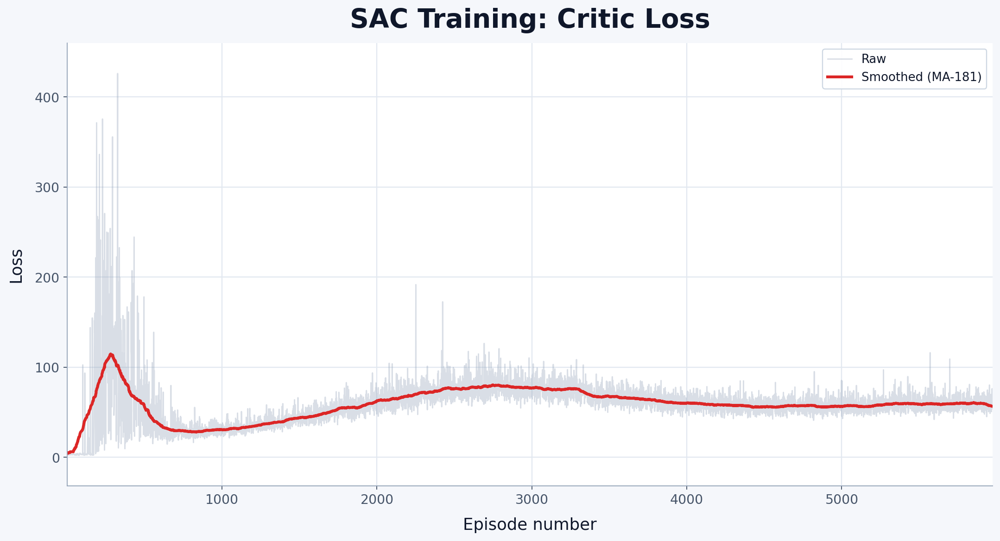
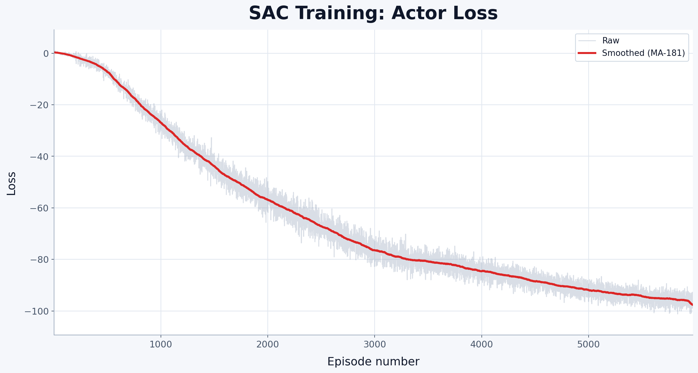
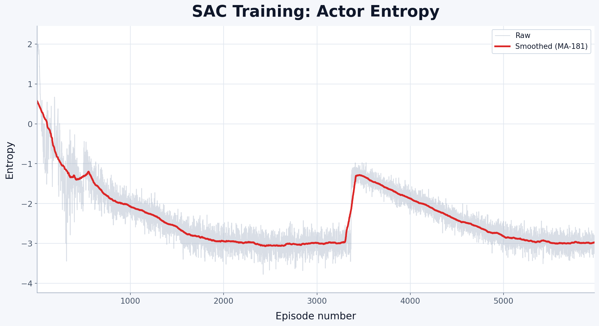
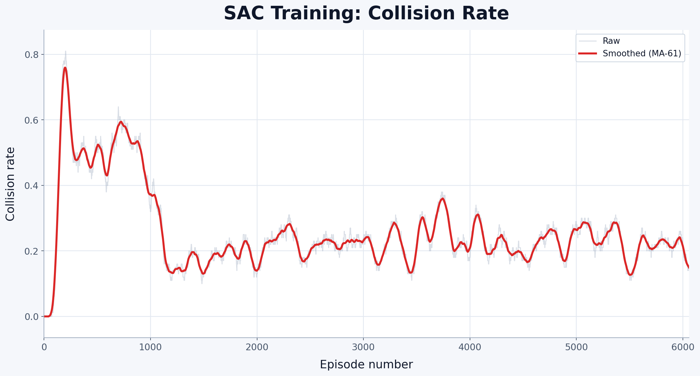

# 🐕 SuperDog

**SuperDog** is a path-planning repository for the **Unitree A1** quadruped robot. A high-level **Soft Actor-Critic (SAC)** policy generates velocity commands, and a frozen pretrained walking policy converts them into 12-DOF joint torques. The robot navigates from a random spawn point to a goal in a room with randomly placed obstacles.

> **Where to start**
>
> - Run & install instructions: [RUNME.md](RUNME.md)
> - Robot config and SAC hyperparameters: [configs/a1.yaml](configs/a1.yaml)
> - Curriculum learning schedule: [configs/curriculum.yaml](configs/curriculum.yaml)
> - Prompt log for repository and documentation work: [PROMPTS.md](PROMPTS.md)
> - MuJoCo documentation: [mujoco.readthedocs.io](https://mujoco.readthedocs.io/)

<p align="center">
  
  
</p>

<a id="table-of-contents"></a>

## 📑 Table of Contents

1. [🎯 Overview](#overview)
2. [🎮 Environment](#environment)
3. [🧰 Main Dependencies and Project Entry Points](#dependencies)
4. [🧠 Architecture](#architecture)
5. [📐 Mathematical Formulation for SAC](#mathematical-formulation-for-sac)
6. [🧾 SAC Training Pseudocode](#sac-training-pseudocode)
7. [👁️ Observation Space](#observation-space)
8. [🎛️ Action Space](#action-space)
9. [🏁 Reward Function](#reward-function)
10. [📈 Curriculum Learning](#curriculum-learning)
11. [⚙️ Initial Hyperparameters](#hyperparameters)
12. [🖼️ Experiments](#experiments)
13. [🤖 Sim2Real](#sim2real)
14. [⚙️ Commands](#commands)
15. [💬 Prompt Log](#prompt-log)
16. [📚 References](#references)

---

<a id="overview"></a>

## 🎯 Overview

SuperDog trains a navigation policy through **curriculum learning** across 7 difficulty levels, progressively increasing obstacle count and tightening reward shaping.

### Policy stack

| Layer | Role | Frequency |
|---|---|---|
| SAC Actor | Generates `[vx, vy, ω]` velocity command | 5 Hz by default (configurable) |
| Walking Policy | Converts command to 12 joint torques | 50 Hz |
| MuJoCo Simulator | Physics step | 500 Hz |

### Core definitions used throughout the README

| Term | Definition |
|---|---|
| **Episode** | One complete rollout from spawn to goal-reached, collision, or timeout. |
| **Success rate** | Fraction of episodes where the robot reaches the goal. Averaged over the last 100 episodes. |
| **Curriculum level** | A difficulty stage that sets obstacle count, episode length, reward weights, and SAC hyperparameters. Advances when `success_rate` exceeds the level threshold. |
| **Asymmetric actor-critic** | The actor sees only sensor data available on a real robot (with noise). The critic sees clean privileged data with additional features (velocity, nearest obstacles). |

---

<a id="environment"></a>

## 🎮 Environment

<p align="center">
  
  
</p>

| Property | Value |
|---|---|
| Robot | Unitree A1 (12 DOF) |
| Simulator | MuJoCo 3.2.3 |
| Room size | Fixed rectangular room |
| Obstacles | 3–20 random boxes (depends on curriculum level) |
| Episode length | 6 000–17 000 steps (curriculum-dependent) |
| Spawn | Random free-space point with clearance ≥ 0.7 m |
| Goal | Random free-space point |

---

<a id="dependencies"></a>

## 🧰 Main Dependencies and Project Entry Points

### Main runtime dependencies

| Dependency | Definition |
| --- | --- |
| `python` | Main runtime for training, evaluation, export, and utility scripts |
| `torch` | Deep learning framework used to implement SAC actor and critic networks |
| `mujoco` | Physics simulator for Unitree A1 and obstacle-rich navigation scenes |
| `numpy` | Numerical array library used across reward, observation, LiDAR, and curriculum logic |
| `tensorboard` | Logging backend for training metrics and experiment analysis |
| `pyyaml` | YAML parser for robot, reward, and curriculum configuration |
| `rsl-rl-lib` | Supporting locomotion and policy-related components used by the project |

### Key files

| File | Purpose |
| --- | --- |
| [RUNME.md](RUNME.md) | Installation and exact run commands |
| [PROMPTS.md](PROMPTS.md) | Prompt log for documentation and repository refinement |
| [configs/a1.yaml](configs/a1.yaml) | Base robot, SAC, reward, LiDAR, and training configuration |
| [configs/curriculum.yaml](configs/curriculum.yaml) | Curriculum levels and per-level overrides |
| [scripts/train.py](scripts/train.py) | Main training and evaluation entry point |
| [scripts/export_to_onnx.py](scripts/export_to_onnx.py) | Actor export for deployment-oriented inference |
| [scripts/inference_onnx.py](scripts/inference_onnx.py) | ONNX inference path |

### Minimal command path

```bash
cd last_project/SuperDog
pip install -e .
python scripts/train.py configs/a1.yaml --train --headless
```

For the full command list and troubleshooting notes, use [RUNME.md](RUNME.md).

---

<a id="architecture"></a>

## 🧠 Architecture

The architecture uses **asymmetric actor-critic**: the critic receives additional privileged information (velocity, obstacle proximity) that the actor does not see — enabling better value estimation while the actor remains deployable on a real robot with limited sensors.

<p align="center">
  
</p>

The actor predicts the high-level command, while the two critic networks estimate soft action values from a richer privileged state. The implementation follows the standard clipped double-Q SAC design, uses a squashed Gaussian policy, and updates target critics with soft Polyak averaging.

---

<a id="mathematical-formulation-for-sac"></a>

## 📐 Mathematical Formulation for SAC

Before the equations, we define the symbols once and keep the notation consistent throughout this section.

1. Symbols and definitions

- $S_t$ is the state at time step $t$.
- $A_t$ is the action sampled at time step $t$.
- $R_t := r(S_t, A_t)$ is the reward received after taking action $A_t$ in state $S_t$.
- $S_{t+1} \sim P(\cdot \mid S_t, A_t)$ is the next state produced by the environment dynamics.
- $A_{t+1} \sim \pi(\cdot \mid S_{t+1})$ is the next action sampled from the current policy.
- $\pi(a \mid s)$ is the stochastic policy.
- $q^w(s, a)$ is the critic, parameterized by weights $w$.
- $q^{w_{\text{target}}}(s, a)$ is the target critic used in the bootstrap term.
- $J^\pi(s)$ is the soft value of state $s$ under policy $\pi$.
- $\gamma$ is the discount factor.
- $\eta$ is the temperature parameter that controls entropy regularization.
- $\alpha_t$ is the actor learning-rate step at update $t$.
- $\theta$ are the actor parameters.
- $\mathbb{A}$ is the action space.
- $\tau$ is the Polyak averaging coefficient used for target-network updates.

---

2. Soft value and Bellman operator

The soft state value is defined before it is used in the Bellman operator:

$$J^\pi(s) := \mathbb{E}_{A \sim \pi(\cdot \mid s)} \left[ q^w(s, A) - \eta \ln \pi(A \mid s) \right]$$

Using that value, the Bellman operator for SAC is written as:

$$\mathcal{P}^\pi[q^w](S_t, A_t) := R_t + \gamma \mathbb{E}_{S_{t+1} \sim P(\cdot \mid S_t, A_t)} \left[ J^\pi(S_{t+1}) \right]$$

For sampled updates, the next-state soft value is approximated with the target critic:

$$J^\pi(S_{t+1}) = q^{w_{\text{target}}}(S_{t+1}, A_{t+1}) - \eta \ln \pi(A_{t+1} \mid S_{t+1})$$

where $A_{t+1} \sim \pi(\cdot \mid S_{t+1})$.

3. TD error and critic loss

The temporal-difference error is defined as:

$$\delta^w(S_t, A_t, S_{t+1}, A_{t+1}) := q^w(S_t, A_t) - \left( R_t + \gamma \left( q^{w_{\text{target}}}(S_{t+1}, A_{t+1}) - \eta \ln \pi(A_{t+1} \mid S_{t+1}) \right) \right)$$

The critic loss is then written directly through that TD error:

$$L(w) = \mathbb{E} \left[ \left( \delta^w(S_t, A_t, S_{t+1}, A_{t+1}) \right)^2 \right]$$

4. Policy network (the actor)

The actor update follows the critic signal while accounting for the entropy-regularized objective:

$$\theta_{t+1} \leftarrow \theta_t + \alpha_t \nabla_\theta q^w(S_t, \pi^\theta(S_t)) \big|_{\theta = \theta_t}$$

5. SAC extension: entropy bonus

The global training objective is:

$$\mathcal{J}_{\text{SAC}}(\pi) := \sum_{t=0}^{\infty} \mathbb{E} \left[ R_t + \eta \mathcal{H}[\pi(\cdot \mid S_t)] \right]$$

with entropy defined as:

$$\mathcal{H}[\pi(\cdot \mid s)] := - \mathbb{E}_{A \sim \pi(\cdot \mid s)} \left[ \ln \pi(A \mid s) \right]$$

6. Change of variables

For $a = \tanh(u)$, the density correction used in the policy is:

$$\ln \pi(a \mid s) = \ln \mu(u \mid s) - \sum_{i=1}^{D} \ln \left( 1 - \tanh^2(u_i) \right)$$

where $D$ is the action dimension.

7. SAC extension: automatic entropy tuning

SAC optimizes the temperature $\eta$ toward a target entropy $\bar{\mathcal{H}}$:

$$J(\eta) = \mathbb{E}_{A \sim \pi(\cdot \mid s)} \left[ -\eta \left( \ln \pi(A \mid s) + \bar{\mathcal{H}} \right) \right]$$

The target entropy heuristic is typically:

$$\bar{\mathcal{H}} = -\dim(\mathcal{A})$$

8. Target network updates

Target parameters are updated with Polyak averaging:

$$w_{\text{target}} \leftarrow \tau w + (1 - \tau) w_{\text{target}}$$

In the current configuration, $\tau = 0.005$.


---

<a id="sac-training-pseudocode"></a>

## 🧾 SAC Training Pseudocode

The listing below is intentionally based on the actual implementation in [src/policy/SAC/SAC.py](src/policy/SAC/SAC.py), [src/policy/SAC/SAC_actor.py](src/policy/SAC/SAC_actor.py), and [src/policy/SAC/SAC_critic.py](src/policy/SAC/SAC_critic.py). It matches the real repository logic rather than a generic textbook SAC loop.

### Definitions used in the listing

- `critic_obs_t` is the replay-buffer observation used by the critic, including privileged features and optional stacked history.
- `actor_obs_t` is the actor-visible observation obtained from `critic_obs_t` after removing privileged critic-only features and appending action-history features when enabled.
- `Q1` and `Q2` are the two outputs of the `DoubleQCritic` module.
- `alpha = exp(log_alpha)` is the learnable temperature used in entropy regularization.
- `soft_update_params(...)` is the Polyak target-network update utility from the codebase.

### Pseudocode

```text
initialize actor πθ
initialize critic with two Q-heads: Q1w, Q2w
initialize target critic with the same weights as critic
initialize learnable log_alpha

for each training step:
    sample weighted batch from replay buffer:
        (critic_obs_t, action_t, reward_t, done_t, critic_obs_t+1)

    build actor_obs_t from critic_obs_t
    build actor_obs_t+1 from critic_obs_t+1

    with no gradient:
        dist_t+1 = actor(actor_obs_t+1)
        action_t+1 = dist_t+1.rsample()
        log_prob_t+1 = sum(dist_t+1.log_prob(action_t+1))

        target_Q1, target_Q2 = target_critic(critic_obs_t+1, action_t+1)
        target_V = min(target_Q1, target_Q2) - alpha * log_prob_t+1
        target_Q = reward_t + (1 - done_t) * gamma * target_V

    current_Q1, current_Q2 = critic(critic_obs_t, action_t)
    critic_loss = mse(current_Q1, target_Q) + mse(current_Q2, target_Q)
    update critic parameters with critic_loss

    if step mod actor_update_frequency == 0:
        dist_t = actor(actor_obs_t)
        sampled_action_t = dist_t.rsample()
        log_prob_t = sum(dist_t.log_prob(sampled_action_t))

        actor_Q1, actor_Q2 = critic(critic_obs_t, sampled_action_t)
        actor_Q = min(actor_Q1, actor_Q2)
        actor_loss = mean(alpha.detach() * log_prob_t - actor_Q)
        update actor parameters with actor_loss

        if temperature is learnable:
            alpha_loss = mean(alpha * (-log_prob_t - target_entropy).detach())
            update log_alpha with alpha_loss

    if step mod critic_target_update_frequency == 0:
        soft-update target critic with tau
```

This is the concrete training pattern used in SuperDog: two critic heads inside one critic module, reparameterized action sampling through `rsample()`, entropy-regularized targets, delayed target-network updates, and adaptive temperature learning.

---

<a id="observation-space"></a>

## 👁️ Observation Space

The project uses **asymmetric observations**: the actor sees only sensor data available on a real robot (with noise), while the critic sees clean privileged data with additional features.

<details>
<summary><b>Actor observation breakdown (47 → 56 dims)</b></summary>

| # | Component | Dim | Normalization / Notes |
| --- | --- | --- | --- |
| 1 | LiDAR sectors (40 beams, min-pooled) | 40 | `[0, 3m] -> [-1, 1]`, noise `σ = 0.02 m` |
| 2 | Angular velocity `ω` | 1 | Divide by `max_angular_vel`, noise `σ = 0.02 rad/s` |
| 3 | `sin(angle to target)` | 1 | Clipped to `[-1, 1]`, noise `σ = 0.05 rad` |
| 4 | `cos(angle to target)` | 1 | Clipped to `[-1, 1]`, noise `σ = 0.05 rad` |
| 5 | Distance to target | 1 | `[0, max_dist] -> [-1, 1]`, noise `σ = 0.05 m` |
| 6 | Previous action `[vx, vy, ω]` | 3 | Clipped to `[-1, 1]` |
|  | Base observation | 47 | Actor-visible observation before history stacking |
| 7 | Action history (last 3 steps × 3 dims) | 9 | Appended to the base observation |
|  | Actor network input | 56 | Final actor input dimension |

</details>

<details>
<summary><b>Critic observation breakdown (49 → 201 dims)</b></summary>

| # | Component | Dim | Notes |
| --- | --- | --- | --- |
| 1 | Actor base observation (clean, no noise) | 47 | Same semantic features as the actor, but without observation noise |
| 2 | Forward velocity `vx` | 1 | Privileged feature, not available to the actor |
| 3 | Lateral velocity `vy` | 1 | Privileged feature, not available to the actor |
|  | Critic base (single frame) | 49 | `47 + 2` privileged velocity terms |
| 4 | History stacking: 4 frames `(t, t-1, t-2, t-3)` | 196 | `49 × 4 = 196` |
| 5 | Top-5 nearest LiDAR distances | 5 | Privileged obstacle-awareness features derived from raw beams |
|  | Critic observation input | 201 | Final critic observation before action concatenation |
| 6 | Action `[vx, vy, ω]` (concat by Q-network) | 3 | Current actor output appended inside the Q-network |
|  | Q-network first linear input | 204 | `201 + 3` |

</details>

---

<a id="action-space"></a>

## 🎛️ Action Space

The SAC actor outputs a 3-dimensional continuous command, squashed through `tanh` into `[-1, 1]`:

| Dim | Variable | Scale |
|---|---|---|
| 0 | `vx` — forward velocity | `cmd_scale[0] = 1.0` |
| 1 | `vy` — lateral velocity | `cmd_scale[1] = 0.5` |
| 2 | `ω` — yaw rate | `cmd_scale[2] = 0.35` |

---

<a id="reward-function"></a>

## 🏁 Reward Function

| Term | Weight | Description |
|---|---|---|
| `reached` | +100.0 | Terminal: goal reached (dist < 0.2 m) |
| `collision` | −500.0 | Terminal: collision (dist to obstacle < 0.35 m) |
| `progress` | +20.0 | Distance reduction toward goal per step |
| `obs_penalty` | −5.0 × f(d) | Exponential penalty for proximity to obstacles |
| `time_penalty` | −0.02 | Per-step penalty to discourage slow trajectories |
| `vx_backward` | −1.0 | Penalty for negative forward velocity |
| `vy_penalty` | −1.0 | Penalty for excessive lateral velocity |
| `velocity_alignment` | +0.5 | Reward for moving in the facing direction |

The obstacle proximity penalty uses an exponential envelope:

```
obs_penalty = obs_penalty_weight × exp(obstacle_exponential_scale × (1 − d / obstacle_threshold))
```

where `d` is the distance to the nearest obstacle and the penalty activates when `d < obstacle_threshold = 1.5 m`.

Reward weights are overridden per curriculum level (see [configs/curriculum.yaml](configs/curriculum.yaml)).

---

<a id="curriculum-learning"></a>

## 📈 Curriculum Learning

Training progresses through 7 levels. A level advances when `success_rate` (averaged over the last 100 episodes) exceeds the level threshold. Each level independently adjusts obstacle count, episode length, reward weights, and SAC hyperparameters.

| Level | Name | Obstacles | Max Steps | Success Target |
|---|---|---|---|---|
| 1 | Initial Learning | 3–5 | 6 000 | 20% |
| 2 | Obstacle Awareness | 4–7 | 7 500 | 40% |
| 3 | Collision Reduction | 6–9 | 9 000 | 60% |
| 4 | Efficiency Optimization | 8–12 | 11 000 | 88% |
| 5 | Mastery | 10–14 | 13 000 | 95% |
| 6 | Perfection | 12–17 | 15 000 | 95% |
| 7 | Polish & Perfection | 15–20 | 17 000 | 97% |

<details>
<summary><b>Click to expand per-level reward and SAC overrides</b></summary>

| Parameter | L1 | L2 | L3 | L4 | L5 | L6 | L7 |
|---|---|---|---|---|---|---|---|
| **Reward weights** | | | | | | | |
| collision | −300 | −400 | −500 | −600 | −800 | −1 000 | −1 500 |
| obs_penalty_weight | 3.0 | 4.0 | 5.0 | 5.5 | 6.0 | 7.0 | 8.0 |
| obstacle_threshold | 1.6 | 1.5 | 1.5 | 1.4 | 1.3 | 1.2 | 1.15 |
| progress | 25 | 22 | 20 | 25 | 30 | 35 | 40 |
| time_penalty | −0.01 | −0.015 | −0.02 | −0.1 | −0.1 | −0.15 | −0.16 |
| vx_backward_penalty | — | — | −2.5 | −3.0 | −3.0 | −5.0 | −6.0 |
| velocity_alignment | — | — | 0.7 | — | — | — | 2.0 |
| **SAC overrides** | | | | | | | |
| actor_lr | 2e-4 | 1.5e-4 | 1e-4 | 8e-5 | 5e-5 | 3e-5 | 1e-5 |
| critic_lr | 5e-4 | 4e-4 | 3e-4 | 2.5e-4 | 2e-4 | 1.5e-4 | 1e-4 |
| init_temperature | 0.1 | 0.15 | 0.2 | 0.3 | 0.4 | 0.6 | 0.8 |
| batch_size | 128 | 192 | 256 | 320 | 384 | 448 | 512 |
| training_iterations | 2 | 3 | 4 | 5 | 6 | 8 | 10 |
| **Replay buffer** | | | | | | | |
| success_weight | 1.5 | 2.0 | 1.5 | 1.5 | 1.0 | 1.5 | 2.0 |
| collision_weight | 1.5 | 1.5 | 2.0 | 3.0 | 5.0 | 10.0 | 15.0 |

Full configuration: [configs/curriculum.yaml](configs/curriculum.yaml).

</details>

---

<a id="hyperparameters"></a>

## ⚙️ Initial Hyperparameters

<details>
<summary><b>Click to expand SAC hyperparameters table</b></summary>

| Hyperparameter | Value |
|---|---|
| **Network** | |
| Actor hidden dims | [512, 512, 256] |
| Critic hidden dims | [512, 512, 256] |
| Weight init | Orthogonal |
| Actor log_std bounds | [−2, 2] |
| **Optimization** | |
| Actor learning rate | 1e-4 |
| Critic learning rate | 3e-4 |
| Alpha learning rate | 3e-4 |
| All betas | (0.9, 0.999) |
| Discount γ | 0.99 |
| Critic soft update τ | 0.005 |
| Actor update frequency | every step |
| Critic target update frequency | every 2 steps |
| **Entropy** | |
| Initial temperature α | 0.2 |
| Target entropy | −1.5 |
| Learnable temperature | yes |
| **Replay buffer** | |
| Buffer size | 1 000 000 |
| Batch size | 512 |
| Training iterations per step | 4 |
| Min buffer size before training | 5 000 |
| **History** | |
| Actor history (action) | 3 steps |
| Critic history (observation) | 3 frames |
| Critic top-k nearest | 5 |

These are the base hyperparameters from [configs/a1.yaml](configs/a1.yaml). Each curriculum level overrides a subset of them — see [configs/curriculum.yaml](configs/curriculum.yaml) for per-level values.

</details>

---

<a id="experiments"></a>

## 🖼️ Experiments

The figures below come from a recorded TensorBoard SAC training run bundled with this repository. Episode metrics use episode index on the x-axis, while `train/*` metrics reflect the logged optimization progression. All displayed curves are smoothed for readability so the main learning trends are easier to inspect.

### Success Rate

<p align="center">
  
</p>

**Axes.** X-axis = episode index. Y-axis = rolling success rate over recent episodes.

The success-rate trajectory shows a meaningful transition from near-random behavior to a much more reliable navigation policy. After the unstable initial phase, the agent spends most of training in a substantially higher-success regime instead of repeatedly collapsing back to failure. This is the clearest indicator that the SAC policy is learning to reach the goal under randomized obstacle layouts.

### Batch Reward Average

<p align="center">
  
</p>

**Axes.** X-axis = logged training progression. Y-axis = `train/batch_reward_av`, the average reward signal observed in training batches.

`train/batch_reward_av` increases steadily across training, which is what we want to see from the optimizer-facing reward signal. In this project, that upward trend means the replayed experience is gradually dominated by more useful trajectories: better target progress, fewer catastrophic interactions with obstacles, and less wasted motion. It is a compact summary that the overall quality of behavior improves over time.

### Critic Loss

<p align="center">
  
</p>

**Axes.** X-axis = logged training progression. Y-axis = critic loss value.

The critic loss exhibits strong early transients, which is expected when the replay buffer is still filling with diverse and highly non-stationary experience. Later, the curve settles into a tighter operating range, suggesting that value estimation becomes more stable as the policy and the state distribution improve. This is a healthy pattern for SAC in a difficult navigation task with sparse success and hard collision penalties.

### Actor Loss

<p align="center">
  
</p>

**Axes.** X-axis = logged training progression. Y-axis = actor loss value.

The actor loss trends downward throughout training instead of drifting chaotically, which indicates sustained policy improvement against the critic-defined objective. In practical terms, the policy is becoming better at proposing high-level commands that both make progress toward the target and avoid obviously dangerous motion patterns. The long downward slope is a sign of continued refinement rather than early stagnation.

### Actor Entropy

<p align="center">
  
</p>

**Axes.** X-axis = logged training progression. Y-axis = actor entropy.

Actor entropy decreases over time, meaning the policy gradually shifts from broad exploration to more confident action selection. That behavior is expected in SAC: the policy first needs to try many motion strategies, then it can collapse toward more reliable command distributions once obstacle-avoidance and goal-reaching patterns become repeatable. The late-stage low-entropy regime suggests consolidation rather than random exploration.

### Collision Rate

<p align="center">
  
</p>

**Axes.** X-axis = episode index. Y-axis = rolling collision rate over recent episodes.

The collision-rate plot shows the safety story of training. Unsafe behavior is common at the beginning, but the metric falls sharply once the policy starts exploiting LiDAR structure and the reward shaping more effectively. The later regime is not perfectly flat, but it is much safer than the initial phase and is consistent with the intended curriculum-driven emergence of obstacle-aware navigation.

---

<a id="sim2real"></a>

## 🤖 Sim2Real

The project now includes a first successful sim2real-style result artifact. The GIF below is the compact preview version, and the still image shows the control interface during the experiment.

<p align="center">
  
  
</p>

The left panel shows the deployment-style result preview, while the right panel captures the operator-side control setup used during the run. The full recorded result is also available as a video file: [2026-03-26 07.42.49.mp4](docs/2026-03-26 07.42.49.mp4).

---

<a id="commands"></a>

## ⚙️ Commands

For installation and the exact operational command set, use [RUNME.md](RUNME.md). The most common entry points are:

```bash
python scripts/train.py configs/a1.yaml --train --headless
python scripts/train.py configs/a1.yaml
tensorboard --logdir runs/Mar26_04-55-56_griga-Katana-GF76-12UGSO
python scripts/export_to_onnx.py --model_path data/models/<run_id>/sac_actor.pth --config_path configs/a1.yaml --output_path sac_actor.onnx
```

---

<a id="prompt-log"></a>

## 💬 Prompt Log

The prompt log for repository and documentation work is stored separately in [PROMPTS.md](PROMPTS.md).

---

<a id="references"></a>

## 📚 References

- Tuomas Haarnoja, Aurick Zhou, Pieter Abbeel, and Sergey Levine. "Soft Actor-Critic: Off-Policy Maximum Entropy Deep Reinforcement Learning with a Stochastic Actor." [arXiv:1801.01290](https://arxiv.org/abs/1801.01290)
- Tuomas Haarnoja, Aurick Zhou, Kristian Hartikainen, George Tucker, Sehoon Ha, Jie Tan, Vikash Kumar, Henry Zhu, Abhishek Gupta, Pieter Abbeel, and Sergey Levine. "Soft Actor-Critic Algorithms and Applications." [arXiv:1812.05905](https://arxiv.org/abs/1812.05905)
- MuJoCo documentation: [mujoco.readthedocs.io](https://mujoco.readthedocs.io/)
- Unitree Robotics official website: [unitree.com](https://www.unitree.com/)
- OpenAI Spinning Up SAC overview: [spinningup.openai.com/en/latest/algorithms/sac.html](https://spinningup.openai.com/en/latest/algorithms/sac.html)
